autoscale: true
slidenumbers: true
## Monitoring
## [fit] **Kubernetes Cronjobs**

<br/><br/>
Scott Baldwin

@scottsbaldwin


^ http://images.pond5.com/ekg-heart-monitor-blue-footage-012418933_prevstill.jpeg

<!--
---
Hidden slide
-->
---
# Demo Bootstrap


```bash
minikube start
eval $(minikube docker-env)
helm init
```

^ had to install helm 2.8.2 because 2.9.0 was broken with minikube
^ https://cdn-images-1.medium.com/max/1600/1*fMjeHmaGDI5UIzzvyDuUoQ.png

---
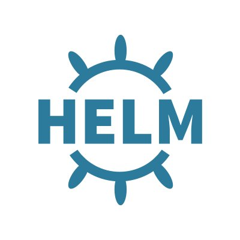

## helm install

## [fit] stable/**prometheus**
## [fit] stable/**kube-state-metrics**
## [fit] stable/**grafana**

^ helm repo add stable https://kubernetes-charts.storage.googleapis.com
^ helm install -n prometheus stable/prometheus
^ helm install -n kube-state-metrics stable/kube-state-metrics
^ helm install -n grafana stable/grafana

^ kube-state-metrics - these make it so that we can query on k8s job stuff

^ https://pbs.twimg.com/profile_images/859843681553178624/AHcBc6EG.jpg

---
# [fit] Load Up Prometheus

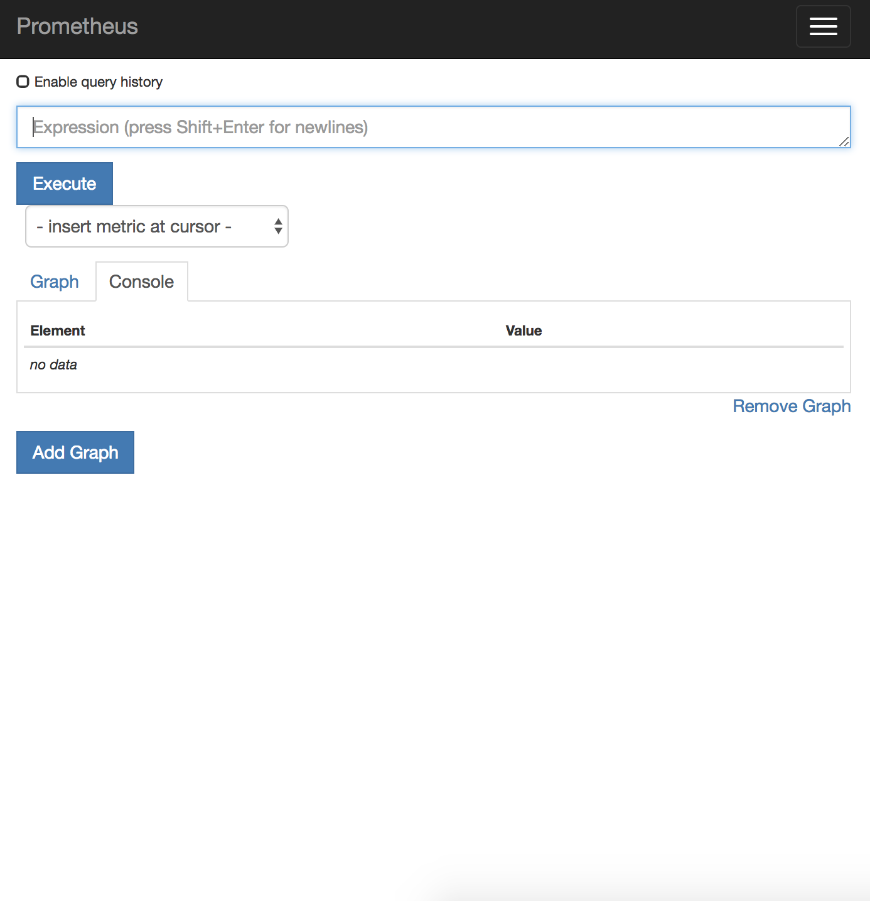

```bash
export PROM_POD_NAME=$( \
    kubectl get pods \
    -l "app=prometheus,component=server" \
    -o jsonpath="{.items[0].metadata.name}" \
)

kubectl port-forward $PROM_POD_NAME 9090
```

## http://localhost:9090

---
# [fit] Load Up Alert Manager

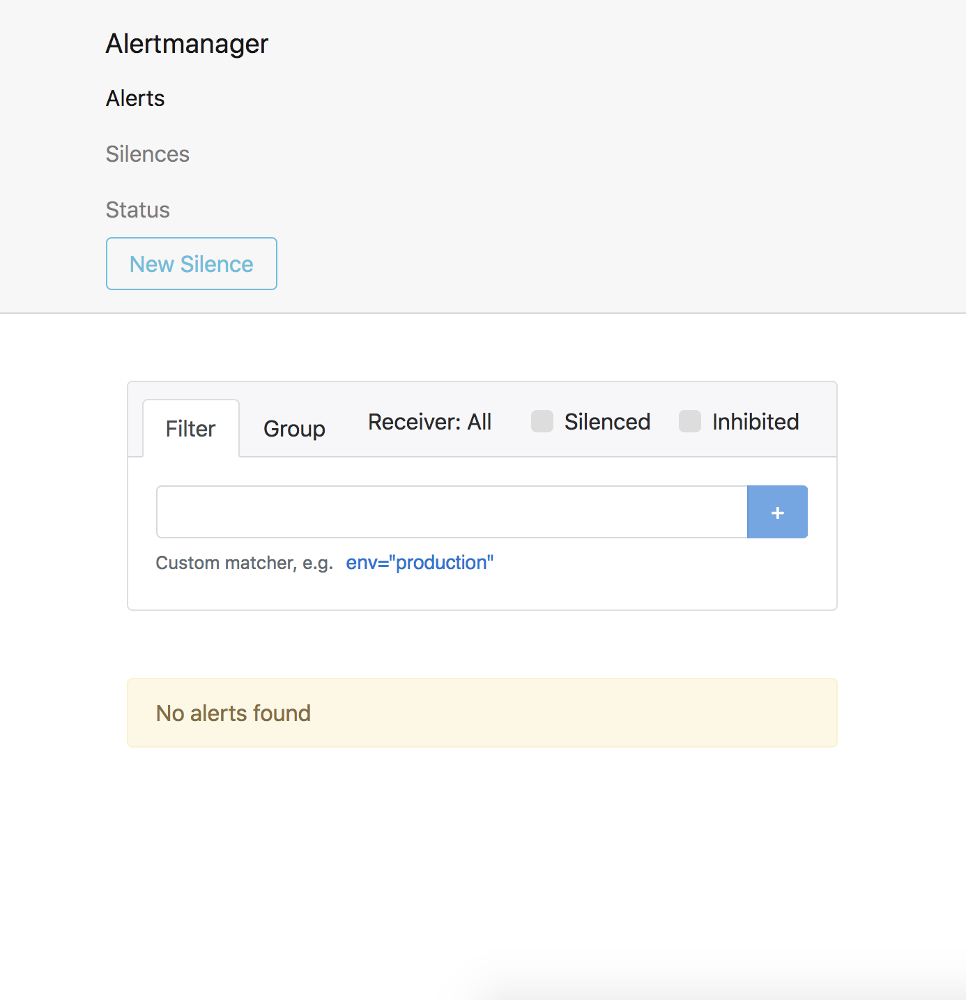

```bash
export ALERT_POD_NAME=$( \
    kubectl get pods \
    -l "app=prometheus,component=alertmanager" \
    -o jsonpath="{.items[0].metadata.name}" \
)

kubectl port-forward $ALERT_POD_NAME 9093
```

## http://localhost:9093

---
# Load Up Grafana

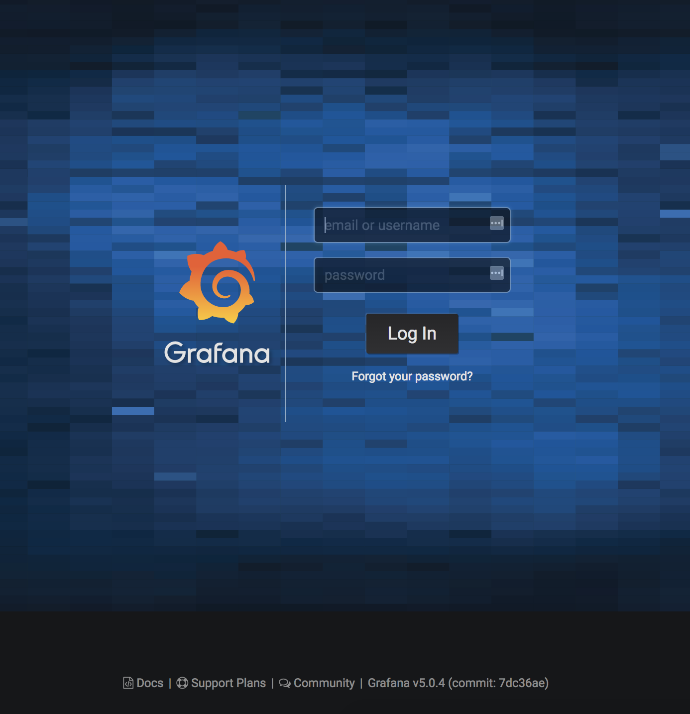

```bash
export GRAFANA_POD_NAME=$( \
    kubectl get pods \
    -l "app=grafana" \
    -o jsonpath="{.items[0].metadata.name}" \
)

kubectl port-forward $GRAFANA_POD_NAME 3000
```

## http://localhost:3000

---
# Grafana Login

```bash
kubectl get secret grafana \
    -o jsonpath="{.data.admin-password}" | \
    base64 --decode ; echo
```

<br/><br/>

Username: **_admin_**

Password: **_pGotZvIys7vIfX6D8lOLbUCCjILIsSlTxVJAUGxi_**

---
# [fit] Wire Up Grafana Datasource

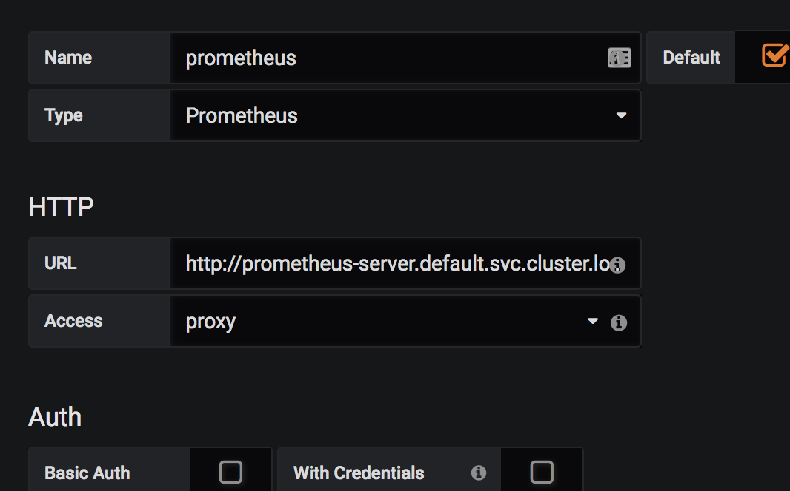

# [fit] **http://prometheus-server.default.svc.cluster.local**

---
# [fit] Wire Up Alert Manager

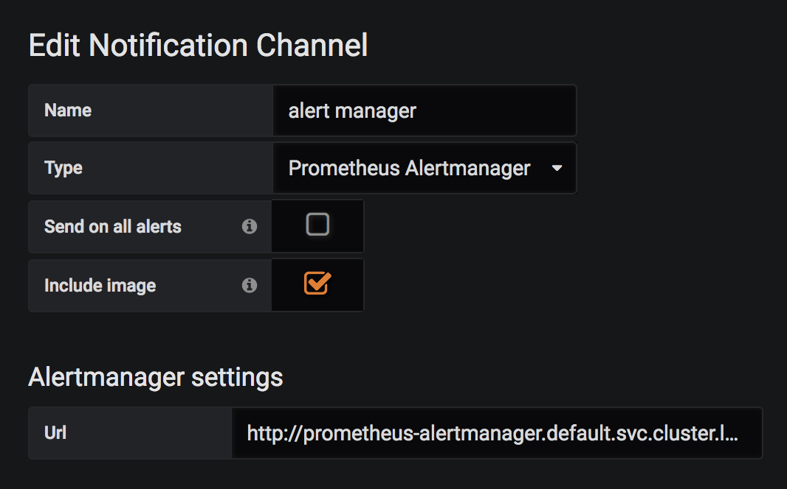

# [fit] **http://prometheus-alertmanager.default.svc.cluster.local**

^ Type: Prometheus Alertmanager

^ since it's setup as part of prometheus

---
# [fit] Cronjob destined for failure

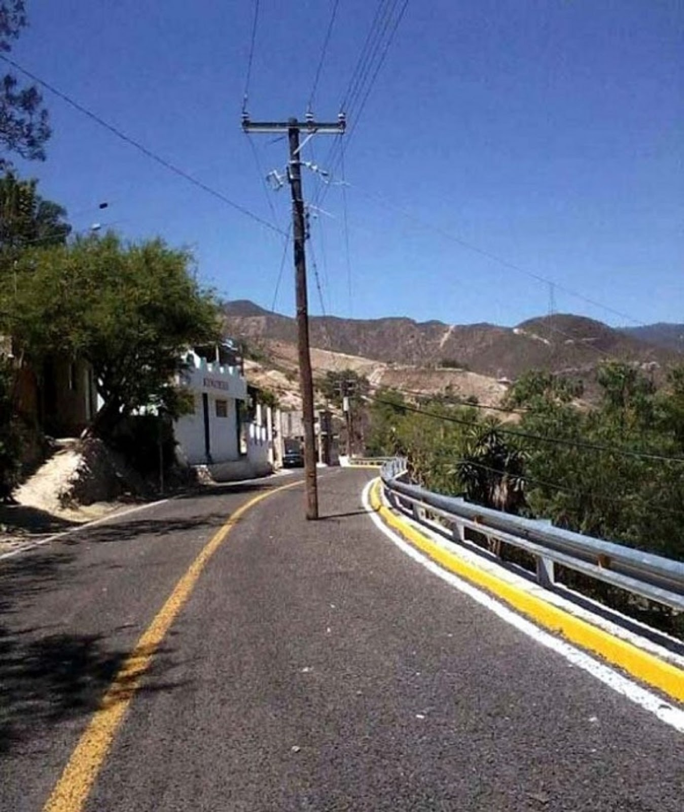

```yaml
apiVersion: batch/v1beta1
kind: CronJob
...
spec:
  schedule: "*/5 * * * *"
  ...
  jobTemplate:
    ...
    spec:
      backoffLimit: 0
      template:
        ...
        spec:
          containers:
          - name: devopsdays-demo
            command:
            - /bin/false
            image: alpine
          restartPolicy: Never
```

^ http://2.bp.blogspot.com/-fGcPhXQjRVI/Vgcl6_Y6ktI/AAAAAAAAaQU/dDukv2L4Nt8/s1600/fotos_11470_poste%2B%25281%2529.jpg

---
# [fit] Create the Cronjob

```
$ kubectl apply -f cronjob.yaml
cronjob.batch "devopsdays-demo" created

$ kubectl get cronjob
NAME              SCHEDULE      SUSPEND   ACTIVE    LAST SCHEDULE   AGE
devopsdays-demo   */5 * * * *   False     0         55s             2m

$ kubectl get job
NAME                         DESIRED   SUCCESSFUL   AGE
devopsdays-demo-1525298400   1         0            1m

$ kubectl get pod -l cronjob=devopsdays-demo
NAME                               READY     STATUS    RESTARTS   AGE
devopsdays-demo-1525298400-7lsnf   0/1       Error     0          2m
```

---
# [fit] **_kube-state-metrics_**
## add-on is magic

^ See https://github.com/kubernetes/kube-state-metrics
^ Add-on agent to generate and expose cluster-level metrics.

---
# [fit] Prometheus Query


```
clamp_max(label_replace(label_replace(
    max(
        kube_job_status_start_time * ON(exported_job) GROUP_RIGHT() kube_job_labels{label_cronjob!=""}
    ) BY (exported_job, label_cronjob)
    == ON(label_cronjob) GROUP_LEFT()
    max(
        kube_job_status_start_time * ON(exported_job) GROUP_RIGHT() kube_job_labels{label_cronjob!=""}
    ) BY (label_cronjob),
    "job", "$1", "exported_job", "(.+)"),"cronjob", "$1", "label_cronjob", "(.+)"), 1
)
* ON(job) GROUP_LEFT()
label_replace(label_replace(
    (kube_job_status_failed != 0),
    "job", "$1", "exported_job", "(.+)"),"cronjob", "$1", "label_cronjob", "(.+)"
)
```

^ https://d15shllkswkct0.cloudfront.net/wp-content/blogs.dir/1/files/2017/11/prometheus_logo.png

---

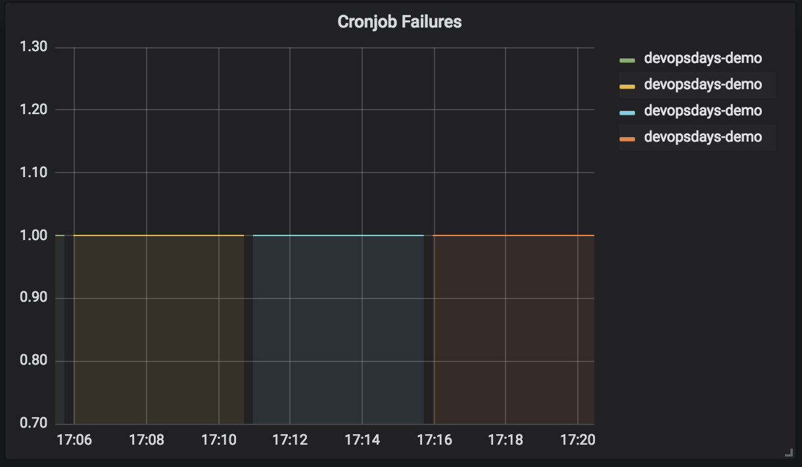

^ [.background-color: #000000]

---

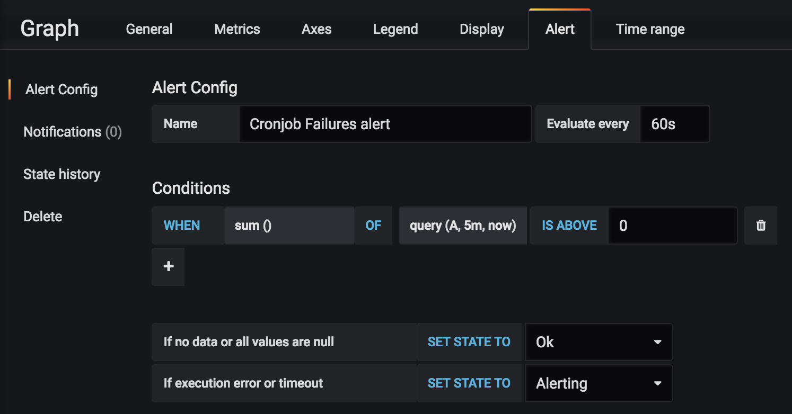

^ [.background-color: #000000]

---

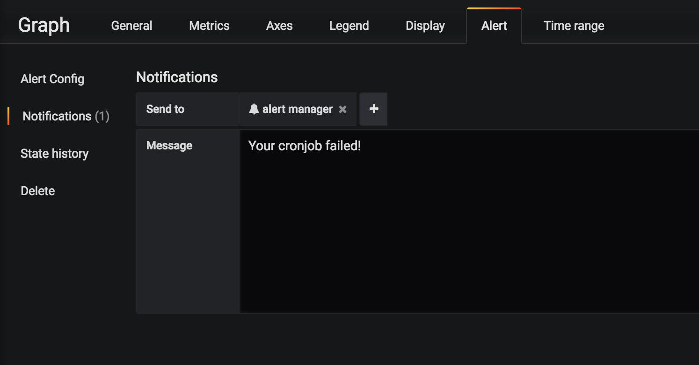

^ [.background-color: #000000]

---

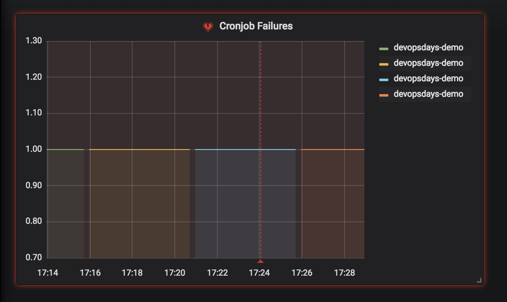

^ [.background-color: #000000]

---

# alert manager

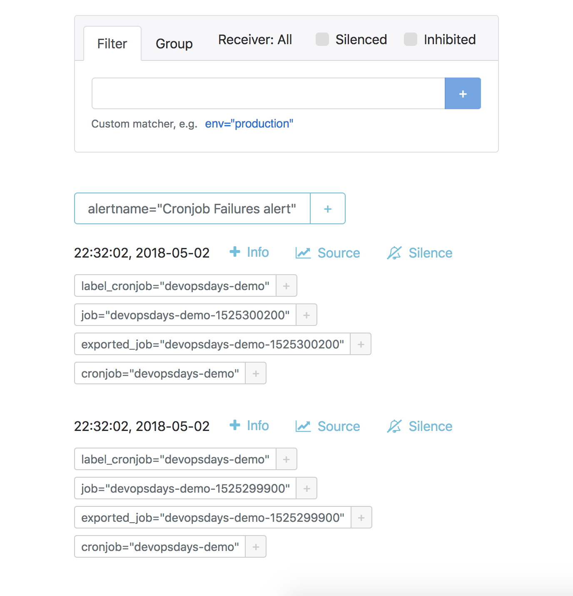

---

# [fit] Cronjob destined for success


```yaml
apiVersion: batch/v1beta1
kind: CronJob
...
spec:
  schedule: "*/5 * * * *"
  ...
  jobTemplate:
    ...
    spec:
      backoffLimit: 0
      template:
        ...
        spec:
          containers:
          - name: devopsdays-demo
            command:
            - /bin/true
            image: alpine
          restartPolicy: Never
```

^ https://cdn.vox-cdn.com/thumbor/is_NgtjXhXGMGIyIyGjbdQ41tpw=/0x0:1118x624/1200x800/filters:focal(470x223:648x401)/cdn.vox-cdn.com/uploads/chorus_image/image/59406829/Screen_Shot_2018_04_16_at_11.12.47_AM.1523895150.png

---
## The alerts have **cleared**

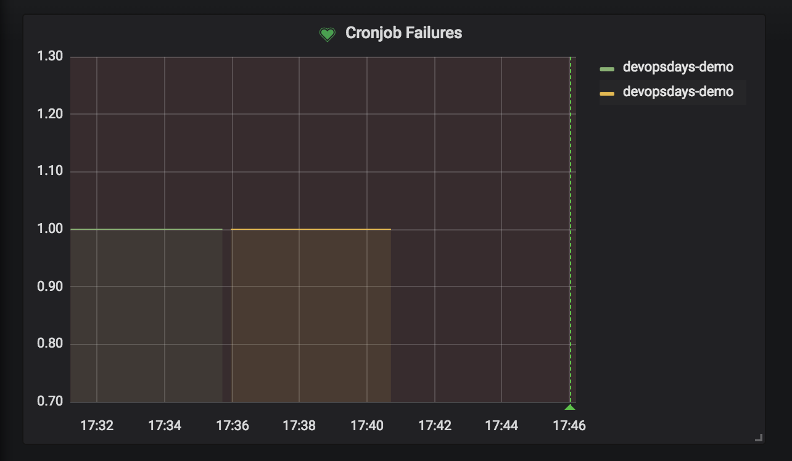

<br/><br/><br/><br/><br/><br/><br/><br/><br/>

## **@scottsbaldwin**

# [fit] *https://medium.com/@tristan_96324/prometheus-k8s-cronjob-alerts-94bee7b90511*